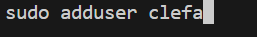
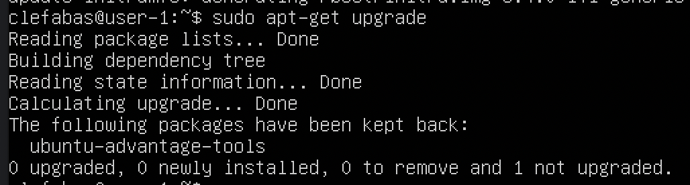
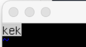
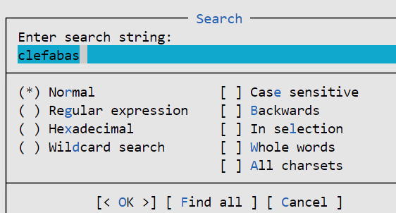
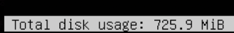

## Part 1. Установка ОС
- Вывод команды cat /etc/issue:\

## Part 2. Создание пользователя
- Вызов команды для создания пользователя: \
  
- Вывод команды cat /etc/passw: \

## Part 3. Настройка сети ОС
- Задали название машины вида user-1:\

- Установили временную зону, соответствующую нашему текущему местоположению:\

- Вывели названия сетевых интерфейсов с помощью консольной команды:\

    - *Интерфейс lo (Loopback) является виртуальным сетевым интерфейсом в операционных системах Unix и Linux. Означает, что наша операционная система работает с виртуальным интерфейсом, который обычно имеет IP-адрес 127.0.0.1. Он представляет собой специальный интерфейс, который используется для внутренних сетевых коммуникаций на уровне ядра, а также для тестирования сетевых функций устройства без фактического подключения к сети.*
- Используя консольную команду, получили ip адрес устройства, на котором работаем, от DHCP сервера:\
  
    - Таким образом наш IP-адрес 10.0.2.15
    - *DHCP расшифровывается как "Протокол динамической конфигурации хоста" (Dynamic Host Configuration Protocol). Это сетевой протокол, который используется для автоматической настройки IP-адресов, шлюзов по умолчанию и других сетевых параметров для устройств в сети. DHCP позволяет устройствам автоматически получать необходимую сетевую конфигурацию при подключении к сети, что делает управление сетевыми настройками более удобным и эффективным.*
- Определили и вывели на экран внешний ip-адрес шлюза (ip) и внутренний IP-адрес шлюза, он же ip-адрес по умолчанию (gw).\
  
    - Таким образом, 10.0.2.2 - внешний ip-адрес шлюза(ip), а 10.0.2.15 - внутренний ip-адрес(gw)
- В файле конфигурации netplan в текстовом редакторе задали статичные настройки ip, gw, dns,используя публичный DNS серверы, 1.1.1.1 или 8.8.8.8.\
  

- Перезагрузили виртуальную машину(root). Убедились, что статичные сетевые настройки (ip, gw, dns) соответствуют заданным в предыдущем пункте(ip a).\
  
- Пропинговали удаленные хосты 1.1.1.1 и ya.ru. В выводе команды получили фразу «0% packet loss»\
  \
  

## Part 4. Обновление ОС
- После повторного обновления системных пакетов, сообщение, что обновления отсутствуют:\
  

## Part 5. Использование команды sudo
- Разрешили пользователю, созданному в Part 2,выполнять команду sudo:\
  
- Поменяли hostname ОС от имени пользователя, созданного в пункте Part 2: \
  
- Скрин с изменённым hostname: \
  
- *Истинное назначение команды sudo состоит в том, чтобы предоставлять временные привилегии администратора для выполнения определенных команд, необходимых для выполнения задачи, но не требующих постоянного входа в систему под учетной записью суперпользователя (root). Это позволяет повысить безопасность системы, поскольку ограничивает возможность выполнять команды с административными правами только тем пользователям, которым это действительно нужно, и предотвращает случайное выполнение опасных команд под учетной записью суперпользователя.*

## Part 6. Установка и настройка службы времени
- Время часового пояса, в котором сейчас находимся:\
  
- Вывод команды timedatectl show:\
  
## Part 7. Установка и использование текстовых редакторов
- Установили текстовые редакторы VIM, NANO, MCEDIT
- Используя каждый из трех выбранных редакторов, создали файл test_X.txt, где X -- название редактора, в котором создан файл. Написали в нём свой никнейм, закрыли файл с сохранением изменений.
  - Файл test_vim.txt перед закрытием.\
    
  - Для выхода из редактора vim использовали :wq
  - Файл test_nano.txt перед закрытием:\
    
  - Для выхода из редактора nano использовали ctrl+x и Y(для подтверждения сохранения документа)
  - Файл test_mcedit.txt перед закрытием:\
     
  - Для выхода из редактора mcedit использовали esc и yes
- Используя каждый из трех выбранных редакторов, открыли файл на редактирование, отредактировали файл, заменив никнейм на строку «21 School 21», закрыли файл без сохранения изменений.
  - Файл test_vim.txt перед закрытием:\
    
  - Для выхода из редактора vim использовали :q
  - Файл test_nano.txt перед закрытием:\
    
  - Для выхода из редактора nano использовали ctrl+x и N(для отмены сохранения документа)
  - Файл test_mcedit.txt перед закрытием:\
    
  - Для выхода из редактора mcedit использовали esc и no
- Поиск и замена для каждого из редакторов
  - Vim поиск - используем команду :s/(слово, которое ищем), в нашем случае ищем слово "kek". Вывод: \
        
  - Vim замена - используем команду :s/(слово, которое меняем)/(на что меняем), в нашем случае меняем слово "clefabas" на "kek". Вывод: \
    
  - Nano поиск - используем команду cntr+w вводим слово, которое ищем, в нашем случае ищем слово "clefabas". Вывод(просто курсор переносится): \
     \  
      
  - Nano замена - используем команду cntrl+/, меняем слово "clefabas" на "kek". Вывод: \
    
  - Mcedit поиск - используем F7 вводим слово, которое ищем, в нашем случае ищем слово "clefabas" и нажимаем "ок". Вывод: \
       
  - Mcedit замена - используем F4, меняем слово "clefabas" на "kek". Вывод: \
    
          

## Part 8. Установка и базовая настройка сервиса SSHD
- Установили службу SSHd командой:\
   
- Добавили автостарт службы при загрузке системы с помощью утилиты "systemctl"консольной командой:\
  
- Перенастроили службу SSHd на порт 2022 в конфигурационном файле sshd_config, заменив Port 22 на Port 2022.\
   
 - Используя команду ps, показали наличие процесса sshd:\
   
   - ps: команда для вывода информации о процессах.
   - a: ключ отображает процессы для всех пользователей.
   - u: ключ отображает подробную информацию о процессе, включая пользователя, который запустил процесс, и время его запуска.
   - x: ключ показывает также процессы, не привязанные к текущему терминалу.
   - grep sshd: Эта команда фильтрует вывод ps, показывая только строки, содержащие sshd.
- перезагрузили систему
- Вывод команды netstat -tan:\
   
  - -t: Этот ключ фильтрует вывод только для TCP-соединений. 
  - -a: Этот ключ отображает все сетевые соединения и прослушиваемые порты, включая те, которые находятся в состоянии LISTENING (прослушивания). Без этого ключа команда netstat может не отображать некоторые сетевые соединения, которые находятся в "неактивном" состоянии.
  - -n: Этот ключ отключает резольвинг имен хостов. Вместо этого выводятся IP-адреса в числовом формате, что ускоряет выполнение команды netstat, так как нет необходимости в обращении к DNS для определения имен хостов. 

  - tcp: Это протокол, в данном случае TCP.
  - 0: Это номер PID процесса, связанного с этим соединением (в данном случае 0, что означает, что процесс не определен).
  - 0: Это номер очереди на отправку данных.
  - 0.0.0.0:2022: Это локальный адрес и порт, на котором слушает сервер (0 0.0.0 означает все доступные сетевые интерфейсы, а 2022 - номер порта).
0.0.0.0:*: Это удаленный адрес и порт (в данном случае * означает, что адрес и порт не определены).
  - LISTEN: Это состояние соединения. В данном случае LISTEN означает, что сервер слушает порт и готов принимать новые соединения.
  - Значение 0.0.0.0 в адресе означает, что сервер прослушивает все доступные сетевые интерфейсы. Это позволяет серверу принимать входящие соединения на всех интерфейсах, доступных на данном устройстве.
 ## Part 9. Установка и использование утилит top, htop
- Установили утилиты top и htop.
- По выводу команды top определили:
  - uptime. \
    
    - Система работает в течение минуты со времени последней перезагрузки, текущее время 14:38:28.
  - количество авторизованных пользователей. \
    
    - 1 пользователь
  - общая загрузку системы. \
    
    - 0.24, 0.17, 0.07 - загрузка за 1,5 и 15 минут соответственно
  - общее количество процессов - 101. 
  - загрузка cpu. \
    
    - Чтобы оценить общую загрузку процессора, можно обратить внимание на параметры us (пользовательское использование), sy (системное использование). Загрузка нашего cpu 0.
  - загрузка памяти. \
    
    - информация о загрузке памяти отображается в строках MiB Mem (физическая память) и MiB Swap (подкачка). 
  - pid процесса занимающего больше всего памяти - 1 \
    
  - процессорное время ничто не занимает
- Выводы команды htop:
  - Отсортированному по PID \
    
  - Отсортированному по PERCENT_CPU \
     
  - Отсортированному по PERCENT_MEM \
     
  - Отсортированному по TIME \
     
  - Отфильтрованному для процесса sshd \
     
  - С процессом syslog, найденным, используя поиск \
        
  - С добавленным выводом hostname, clock и uptime \
     
## Part 10. Использование утилиты fdisk
- Использовали команду fdisk -l. Диск /dev/sda2, размер - 21.34Г, количество секторов - 44736512, размер swap - 0
## Part 11. Использование утилиты df
- Утилита df, корневой раздел 
  - размер раздела - 9.75 Гб(10218772 Kb)
  - размер занятого пространства - 2.63 Гб(2755652 Kb)
  - размер свободного пространства - 6.6 Гб(6922448 Kb)
  - процент использования - 29%
- Утилита df -Th, корневой раздел 
  - размер раздела - 9.8 Гб
  - размер занятого пространства - 2.7 Гб
  - размер свободного пространства - 6.7 Гб
  - процент использования - 29%
- Тип файловой системы для раздела -  ext4
## Part 12. Использование утилиты du
- Размер папок /home, /var, /var/log \
  
- Размер всего содержимого в /var/log \
  
## Part 13. Установка и использование утилиты ncdu
- Размер папок /home, /var, /var/log
  - ncdu /home вывод \
     
  - ncdu /var вывод \
      
  - ncdu /var/log вывод \
           
## Part 14. Работа с системными журналами
- Время последней успешной авторизации - Feb 23 14:52:35
- Имя пользователя - "user-2"
- Метод входа в систему - использовался модуль PAM для аутентификации пользователя \
  
- Перезапустили службу SSHd и получили сообщение о рестарте службы в файле syslog;\
  
## Part 15. Использование планировщика заданий CRON
- Используя планировщик заданий(комманда crontab -l), запустили команду uptime через каждые 2 минуты. 
- В системных журналах строчки о выполнении \
  
- Список текущих заданий для CRON \
  
- Удалили задания из планировщика заданий
- Список текущих заданий для CRON \
  
