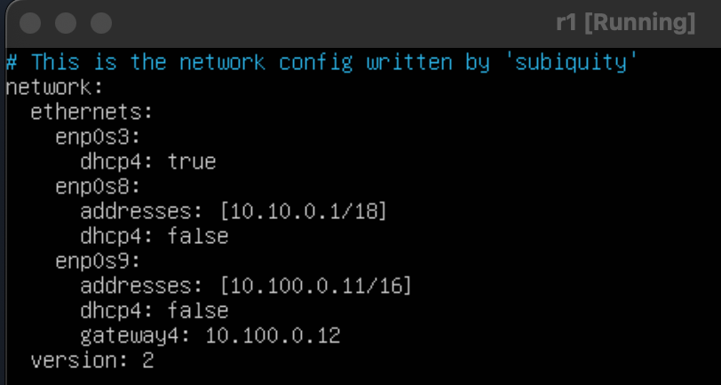
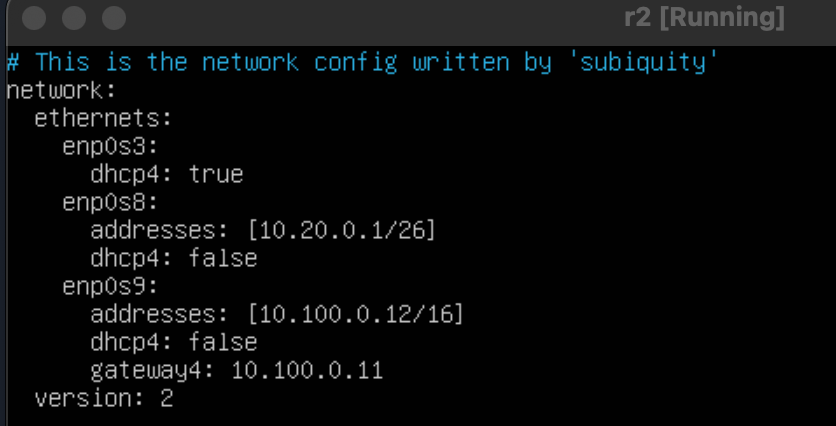
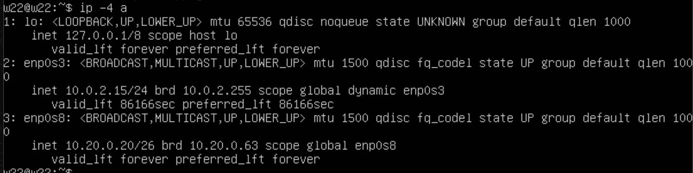
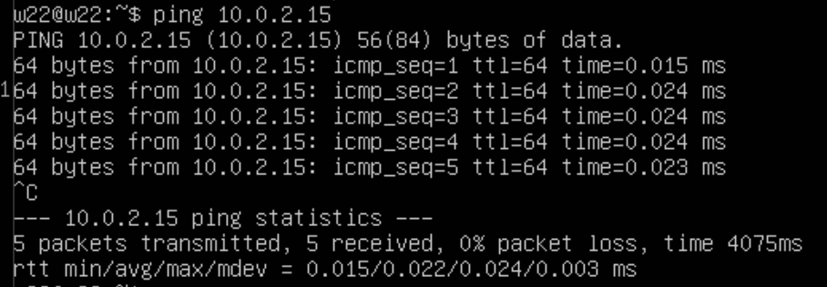
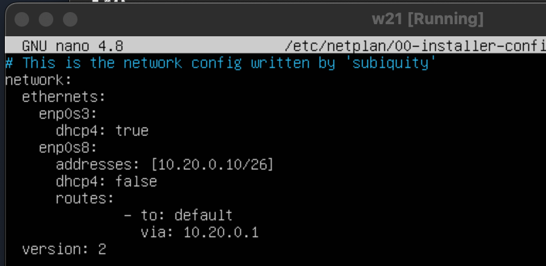
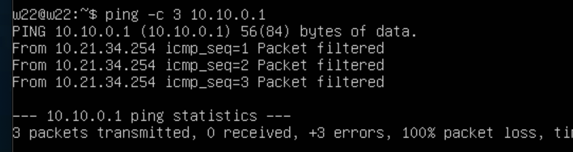

## Part 1. Инструмент ipcalc
* 1.1 Сети и маски:
1) Адрес сети 192.167.38.54/13\

2) Перевод:
- маски 255.255.255.0 в префиксную и двоичную запись
  - Маска 255.255.255.0 эквивалентна /24 в CIDR нотации. Это потому, что в 255.255.255.0 есть 24 бита, которые устанавливаются в 1.
  - маска 255.255.255.0 в двоичной записи будет: 11111111.11111111.11111111.00000000
- Перевод /15 в обычную и двоичную запись
  - 255.254.0.0
  - 11111111.11111110.00000000.00000000
- Перевод 11111111.11111111.11111111.11110000 в обычную и префиксную запись
  - 255.255.255.240
  - /28
3) Минимальный и максимальный хост в сети 12.167.38.4 при масках:
  - Для маски /8: Минимальный хост: 12.0.0.1, максимальный хост: 12.255.255.254
  - Для маски 11111111.11111111.00000000.00000000 (255.255.0.0): Минимальный хост: 12.167.0.1, максимальный хост: 12.167.255.254 
  - Для маски 255.255.254.0 (/23): Минимальный хост: 12.167.38.1,максимальный хост: 12.167.39.254
  - Для маски /4: Минимальный хост: 8.0.0.1, максимальный хост: 15.255.255.254

* 1.2 localhost:
  - Из представленных IP-адресов только 127.0.0.2/24 и 127.1.0.1/8 позволяют обращаться к приложению, работающему на localhost.  Така как IP-адреса находится в диапазоне loopback адресации (127.0.0.0-127.255.255.255), который всегда связан с устройством самим собой.
* 1.3. Диапазоны и сегменты сетей
  1) Частными IP-адресами являются: 10.0.0.45, 192.168.4.2, 172.20.250.4, 172.0.2.1, 172.68.0.2, 172.16.255.255 и 10.10.10.10.Публичными IP-адресами являются: 134.43.0.2, 192.172.0.1, и 192.169.168.1.
  2) Возможными шлюзами для сети 10.10.0.0/18 являются: 10.10.0.2, 10.10.10.10 и 10.10.100.1.

## Part 2. Статическая маршрутизация между двумя машинами.
- С помощью команды ip a посмотреть существующие сетевые интерфейсы.
  - ws1 \
  
  - ws2\
  
- Описать сетевой интерфейс, соответствующий внутренней сети, на обеих машинах и задать следующие адреса и маски: ws1 - 192.168.100.10, маска /16, ws2 - 172.24.116.8, маска /12.
  - ws1\
  .png)
  - ws2\
  .png)
- Выполнить команду netplan apply для перезапуска сервиса сети.
  - ws1\
  
  - ws2\
  
* 2.1. Добавление статического маршрута вручную:
- Добавить статический маршрут от одной машины до другой и обратно при помощи команды вида ip r add:
  - ws1\
  
  - ws2\
  
- Пропинговать соединение между машинами:
  - ws1\
  
  - ws2\
  
* 2.2. Добавление статического маршрута с сохранением:
- ws1\

- ws2\

- Пропинговать соединение между машинами:
  - ws1\
  
  - ws2\
  

## Part 3. Утилита iperf3
* 3.1. Скорость соединения
- 8Mbps= =1MB/s, 100MB/s=800000Kbps, 1Gbps=1000Mbps
* 3.2. Утилита iperf3
- ws1\

- ws2\

## Part 4. Сетевой экран:
* 4.1. Утилита iptables.
- ws1  /etc/firewall.sh\

- ws2  /etc/firewall.sh\

- запуск ws1 /etc/firewall.sh\

- запуск ws2 /etc/firewall.sh\

* 4.2. Утилита nmap:
- Командой ping найти машину, которая не "пингуется", после чего утилитой nmap показать, что хост машины запущен.\

- В стратегиях есть различие: на машине ws-1 мы начинаем с разрешения вывода ping'а, а затем его запрещаем, в то время как на машине ws2 происходит точно наоборот.
## Part 5. Статическая маршрутизация сети.
* 5.1. Настройка адресов машин(файлы etc/netplan/00-installer-config.yaml):
- r1\

- r2\

- ws11\

- ws21\

- ws22\

- Перезапустить сервис сети. Ошибок нет, команда ip -4 
- r1\

- r2\

- ws11\
//
- ws21\

- ws22\

- пропинговать ws22 с ws21. Аналогично пропинговать r1 с ws11.
- r1\

- ws22\

* 5.2. Включение переадресации IP-адресов.
- выполнение sysctl -w net.ipv4.ip_forward=1
- r1\

- r2\

- /etc/sysctl.conf  добавление net.ipv4.ip_forward = 1
- r1\

- r2\

* 5.3. Установка маршрута по-умолчанию
- etc/netplan/00-installer-config.yaml w11\

- etc/netplan/00-installer-config.yaml w21\

- etc/netplan/00-installer-config.yaml w22\

- выполнение ip r w11\

- выполнение ip r w21\

- выполнение ip r w22\

- выполнение tcpdump -tn -i eth0
- r1\

- r2\

* 5.4. Добавление статических маршрутов
- r1 etc/netplan/00-installer-config.yaml\

- r2 etc/netplan/00-installer-config.yaml\

- Вызов ip r
- r1\

- r2\

- 5.6. Использование протокола ICMP при маршрутизации
- Запуск на r1 перехват сетевого трафика, проходящего через eth0 с помощью команды tcpdump -n -i eth0 icmp:\

- Пропинговывание с ws11 несуществующий IP

## Part 6. Динамическая настройка IP с помощью DHCP.
- Указали адрес маршрутизатора по-умолчанию, DNS-сервер и адрес внутренней сети. Пример файла /etc/dhcp/dhcpd.conf  для r2 и r1:\

-  В файле resolv.conf прописали nameserver 8.8.8.8\

- Перезагрузили службу DHCP командой systemctl restart isc-dhcp-server\

- через ip a  w21 получили адрес\

- Указали MAC адрес у ws11 в etc/netplan/00-installer-config.yaml\

- WS11 ip a после перезагрузки\

- Запрос обновления ip\

- ip w21 до обновления\

- ip w21 после обновления\

## Part 7. NAT
- В файле /etc/apache2/ports.conf на ws22 и r1 изменили строку Listen 80 на Listen 0.0.0.0:80, то есть сделали сервер Apache2 общедоступным\

- Запустили веб-сервер Apache командой service apache2 start на ws22 и r1\

- Пинг с ws22 до r1 не удаётся\

- Успешно пропинговались с ws22 до r1 после разрешения маршрутизации icmp на r2\

- Изменённый firewall.sh на r2\

- Подключились с ws22 к серверу Apache на r1\

- Подключились с r1 к серверу Apache на ws22\
